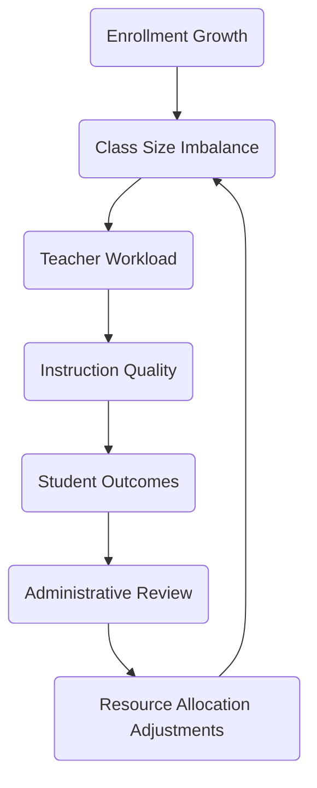
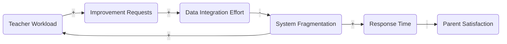

# School Management System (SMS) Efficiency Analysis

## 1. System Definition
The school management system (SMS) orchestrates enrollment, scheduling, instruction, assessment, and communications for a mid-sized district experiencing rapid enrollment growth and hybrid learning demands. The analysis boundary spans academic operations, support services, and enabling infrastructure (information systems, staffing policies, compliance workflows). Key inputs include student registrations, curriculum standards, policy mandates, and budget allocations. Core processes transform these inputs into class schedules, instructional delivery, support interventions, and mandated reports, ultimately producing student outcomes, stakeholder communications, and compliance evidence.

### 1.1 Stakeholders and Components
| Component | Core Responsibilities | Inputs | Outputs | Key Dependencies |
|-----------|-----------------------|--------|---------|------------------|
| Students | Course selection, attendance, performance | Schedules, learning materials, support | Engagement data, assessment results, feedback | Teachers, counselors, digital platforms |
| Teachers | Instruction delivery, assessment, reporting | Curriculum, student data, LMS tools | Grades, learning feedback, support requests | Admin policies, scheduling, IT support |
| Administrators | Resource planning, compliance, communication | Policy mandates, budgets, performance metrics | Staffing decisions, communications, system upgrades | Teachers, IT, regulators |
| IT Support | Maintain SMS, integrations, security | Change requests, incident reports | System uptime, enhancements, training | Vendors, administrators, data governance |
| Parents/Guardians | Monitor student progress, support learning | Notifications, portals, meetings | Feedback, support actions | Teachers, administrators |
| Regulators | Standards, audits, funding rules | Compliance reporting | Accreditation, funding adjustments | Administrators, finance |

### 1.2 Core Process Flow
1. **Enrollment & Scheduling**: Intake data populates schedules; manual conflict resolution introduces delay and class size imbalance.
2. **Instruction & Assessment**: Teachers pull attendance and historical data from disparate systems to tailor instruction, increasing overtime.
3. **Support & Intervention**: Academic and behavioral cases are tracked in separate tools, slowing coordinated responses.
4. **Reporting & Compliance**: Administrators compile submissions from manual exports, raising accuracy risks.
5. **Communication**: Announcements propagate through email, SMS, and LMS without centralized orchestration, creating duplication and gaps.

## 2. System Mapping
Causal loop diagrams and stock-and-flow modeling visualize interdependencies and feedback sensitivity.


**Loop L1 (Balancing)**: Enrollment growth raises class size imbalance, elevating workload and depressing instruction quality. Lower outcomes trigger review and reallocation (hiring, schedule changes). Administrative delays weaken the balancing effect, prolonging imbalance.

.png)


**Loop L2 (Reinforcing)**: Fragmented systems lengthen response time and inflate workload. Higher workload produces more improvement requests; if integration capacity lags, fragmentation persists, compounding stress and lowering satisfaction.


```mermaid
flowchart LR
    subgraph Instruction Capacity
        IStock[Teacher Availability]
    end
    subgraph Demand
        DStock[Student Support Cases]
    end

    EnrollmentRate((Enrollment Rate)) --> DStock
    Graduation((Graduation/Exit)) -->|outflow| DStock

    TeacherHiring((Hiring Rate)) --> IStock
    Attrition((Attrition Rate)) -->|outflow| IStock

    IStock -->|Service Rate| DStock
    PolicyDelays((Policy Approval Delays)) -->|reduces| TeacherHiring
    Automation((Process Automation)) -->|increases| Service Rate
    TrainingLag((Training Lag)) -->|reduces| Service Rate
```
The stock-and-flow view shows support backlogs forming whenever service rate (capacity x efficiency) trails incoming cases, often due to enrollment surges, approval delays, or training gaps.


## 3. System Issues
| Issue | Evidence/Indicators | Root Causes | Impact |
|-------|---------------------|-------------|--------|
| Fragmented data sources | Multiple manual exports, inconsistent IDs | Legacy systems, weak integration governance | High workload, delayed decisions |
| Slow resource reallocation | Hiring decisions lag class size spikes | Quarterly budgeting cycle, manual approvals | Overcrowded classes, burnout |
| Reactive support interventions | Support cases resolved late | Disconnected case management and LMS alerts | Student disengagement, compliance risk |
| Communication overload | Parents miss critical updates | No unified communication calendar, duplicate channels | Lower trust, administrative rework |
| Limited performance feedback | Teachers lack timely analytics | Batch reporting, no real-time dashboards | Inefficient instruction adjustments |
| Compliance reporting crunch | End-of-term manual compilation | Spreadsheet workflows, siloed ownership | Late submissions, audit findings |

## 4. Root Cause Analysis
Focused 5 Whys exploration clarifies structural drivers behind the most disruptive issues.

| Symptom | Why #1 | Why #2 | Why #3 | Why #4 | Why #5 | Core Root Cause |
|---------|--------|--------|--------|--------|--------|------------------|
| Teachers spend hours reconciling data | Data lives in siloed tools | Integrations are batch-based exports | Middleware proposals were deprioritized | Funding prioritized classroom hardware | Capital requests rely on annual approvals | Rigid budgeting cadence blocks timely integration investment |
| Support cases languish for days | Counselors discover issues late | Alerts depend on manual teacher escalation | LMS analytics are not integrated with case workflow | No shared trigger rules across departments | Governance council dissolved during reorg | Lack of cross-functional governance to define and enforce early-warning triggers |

## 5. Proposed System Improvements
| Leverage Point | Intervention | Expected Effect | Implementation Considerations |
|----------------|-------------|-----------------|------------------------------|
| Data integration | Introduce middleware/API gateway syncing SIS, LMS, HR, and finance data with master identifiers | Cuts manual reconciliation, speeds decisions | Stand up data governance council, stage rollout, secure vendor API access |
| Dynamic staffing policies | Move from quarterly to rolling staffing review using trigger thresholds (e.g., >10% class size variance) | Accelerates balancing loop response, reduces overload | Requires policy revision, scenario modeling, cross-budget collaboration |
| Proactive support workflow | Deploy unified case management with automated alerts from attendance and grade signals | Switches interventions from reactive to proactive | Embed predictive analytics, train counselors, codify trigger rules |
| Communication orchestration | Centralize outbound messaging via engagement platform with role-based templates | Reduces duplication, improves clarity | Define escalation paths, integrate academic calendar, segment audiences |
| Teacher analytics dashboard | Publish near real-time dashboards combining assessment, attendance, and engagement | Enables timely instructional adjustments | Provide data literacy coaching, align KPIs with pedagogy |
| Compliance automation | Automate report assembly with standardized data pipelines and validation checks | Shrinks reporting cycle time, lowers error rates | Build metadata catalog, enforce audit trails, plan user acceptance testing |

**Feedback loop refinements**
- Accelerate Loop L1 by automating enrollment trend alerts that trigger pre-approved staffing adjustments.
- Stabilize Loop L2 by funding a dedicated integration squad and enforcing API-first architecture to prevent new silos.

**Monitoring metrics**
- Operational: average class size variance (<5%), support case resolution time (<72 hours), teacher overtime hours per week.
- Experience: parent satisfaction score (>80%), teacher engagement index (>75%), student retention rate.
- Compliance & system health: on-time report submission (100%), audit findings (0 major), data synchronization latency (<1 hour), manual reconciliations (trend toward zero).

## 6. Implementation Considerations
- **Change management**: Mitigate resistance through phased rollouts, co-design workshops with teachers and parents, and transparent progress dashboards.
- **Resource planning**: Allocate budget for integration middleware, analytics tooling, and dedicated data governance staffing; explore multi-year financing to escape annual approval cycles.
- **Stakeholder impact**: Map RACI for each intervention, align with union agreements, and deliver targeted training (teachers on dashboards, counselors on new workflows, administrators on automation safeguards).
- **Risk mitigation**: Maintain master data management discipline, negotiate vendor API clauses early, and coordinate with regulators to avoid policy conflicts.

### 6.1 Roadmap (6-12 Months)
1. **Month 0-2**: Establish steering committee, map integrations, baseline metrics, secure funding.
2. **Month 2-4**: Pilot middleware between SIS and LMS; launch centralized communication calendar prototype.
3. **Month 4-6**: Roll out unified case management workflow; deliver counselor training; publish initial dashboards.
4. **Month 6-9**: Implement staffing trigger policies; automate compliance reporting pipelines; operationalize data governance council.
5. **Month 9-12**: Evaluate outcomes, refine metrics, expand integrations, institutionalize continuous improvement rituals.

## 7. Conclusion and Reflection
Applying systems thinking revealed that ostensibly isolated issues - teacher overtime, delayed interventions, compliance crunches - stem from structural delays, fragmented data flows, and weakened governance feedback loops. Visualizing reinforcing and balancing dynamics highlighted leverage points where automation, policy shifts, and governance can deliver outsized impact. By pairing targeted interventions with deliberate change management and continuous monitoring, the SMS can transition from reactive firefighting to proactive, data-informed coordination that improves experiences for students, educators, and administrators alike.
